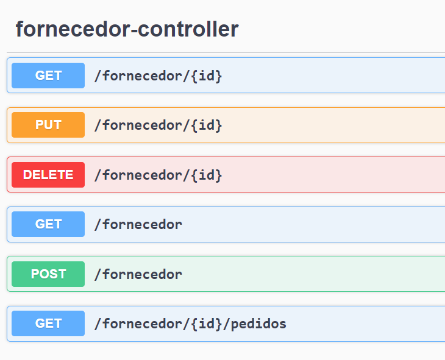
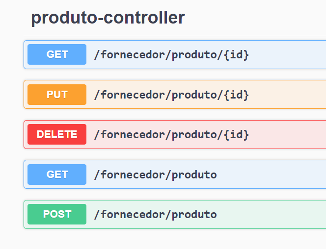
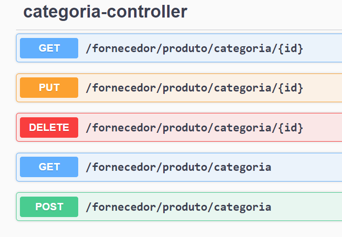
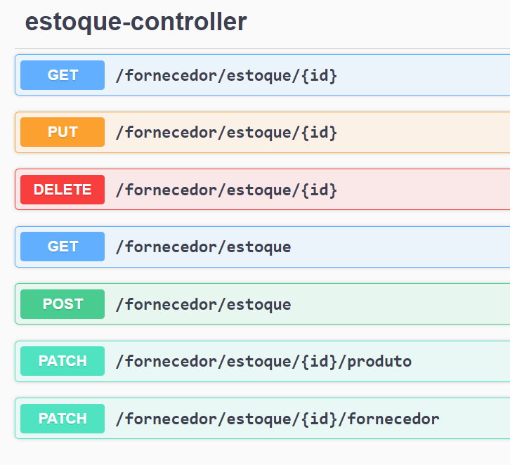
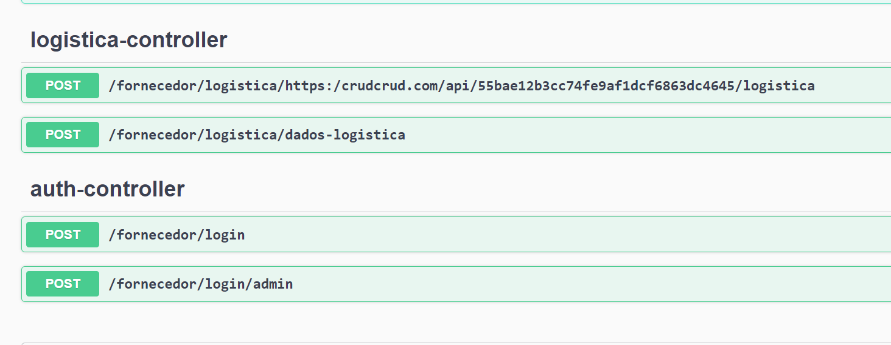

# Quero Ser Dev - Módulo Fornecedor
**Membros**
- Deivisson Macedo
- Gabriela Ricarte
- Igor Oliveira Silva
- João Guilherme Oliveira
- Ramon Vazquez Mastropaulo


**Proposta**<br/>

Através do sistema será possível um fornecedor realizar seu cadastro/login na plataforma. Os fornecedores poderão cadastrar seus próprios produtos, assim como realizar edições e excluções.<br/>
Os fornecedores também poderão alterar seus próprios dados, além de consultar todos os pedidos que foram feitos para ele.<br/>
O sistema também possui um usuário admin interno, onde é possível consultar todos os fornecedores que estão cadastrados, seus pedidos, etc.

### 🛠 Tecnologias
- [Java 17](https://www.oracle.com/java/technologies/javase/jdk17-archive-downloads.html)
- [Maven](https://maven.apache.org/download.cgi)
- [PostgreSQL](https://www.postgresql.org)
- [Hibernate](https://hibernate.org)
- [Lombok](https://projectlombok.org)
- [Swagger](https://swagger.io)

## Como rodar

```
mvn spring-boot:run
```

**Acessar o swagger pelo navegador:**
```
http://localhost:8080/swagger-ui/index.html

```
## Swagger


**Fornecedor**<br/>
<br/>
**Produto**<br/>
<br/>
**Pedido**<br/>
<br/>
**Categoria**<br/>
<br/>
**Estoque**<br/>
<br/>
**Logistica e Auth**<br/>
<br/>
